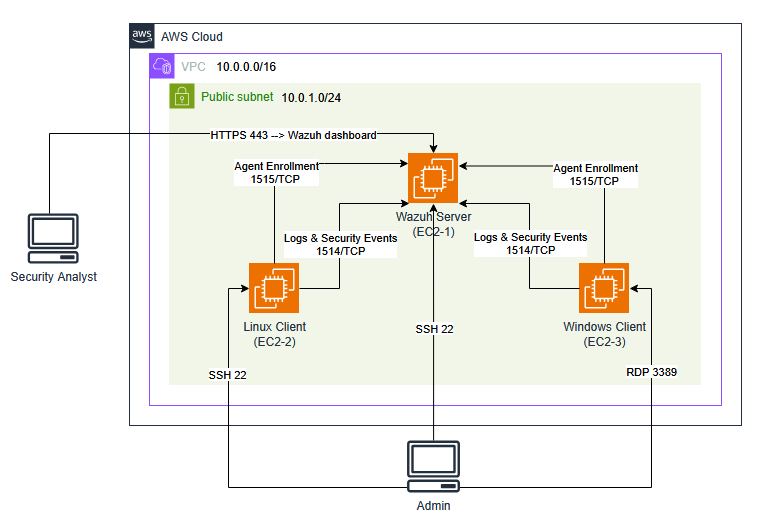
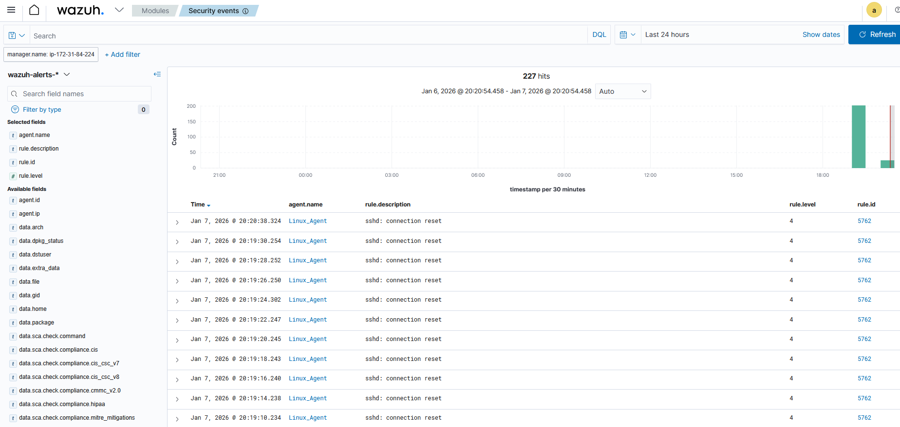
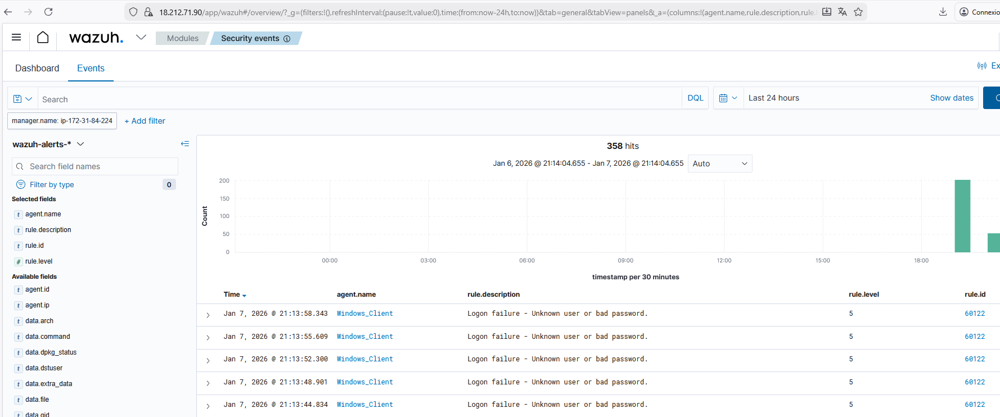

# 🔐 Sécurité des Endpoints et Supervision SIEM  
### Wazuh + AWS (Linux & Windows)

## 📌 Présentation
Ce dépôt contient les livrables d’un atelier pratique portant sur la **sécurité des endpoints**, la **supervision SIEM**, et la **détection des menaces** à l’aide de la plateforme **Wazuh**, déployée sur **AWS**.

Le projet couvre :
- SIEM vs EDR
- IAM / PAM
- Threat Hunting
- Démonstration d’attaques et détections en temps réel

---

## 🏗️ Architecture du Lab
- **Wazuh Server (Ubuntu 22.04)** : SIEM + Dashboard
- **Client Linux (Ubuntu)** : Agent Wazuh
- **Client Windows Server** : Agent Wazuh (+ événements sécurité)
- **AWS VPC** : même subnet, Security Groups contrôlés

📸 **Schéma VPC :**  

---

## 🖥️ Technologies utilisées
- **Wazuh SIEM / EDR**
- **AWS EC2 / VPC / Security Groups**
- **Linux (Ubuntu)**
- **Windows Server**
- SSH / RDP
- Sysmon (optionnel)

---

## 🎥 Démonstration vidéo (lecture directe GitHub)

> 📌 La vidéo suivante montre :
> - Les instances EC2 actives  
> - Le dashboard Wazuh  
> - Les scénarios d’attaque Linux & Windows  
> - Les alertes SIEM / EDR  
> - Le Threat Hunting  

<video src="Demo/demo-siem-wazuh.mp4" controls width="100%"></video>

---

## 🚨 Scénarios d’attaque & détection

### 🔹 Linux
- Tentatives SSH échouées (Bruteforce simulé)
- Élévation de privilèges (`sudo`)
- Modification de fichiers sensibles (FIM)

📸 Exemples :  

---

### 🔹 Windows
- Échecs d’authentification RDP (Event ID 4625)
- Création d’utilisateur local
- Ajout au groupe Administrators

📸 Exemples :  

---

## 📄 Rapport
Le rapport académique complet est disponible ici :

📘 [Rapport SIEM – Taha Nachit](Rapport/Rapport%20SIEM%20TAHA%20NACHIT.pdf)

---

## 👤 Auteur
**Taha Nachit**  
Filière : GLSID  
Établissement : ENSET Mohammedia  
Année universitaire : 2025/2026  

Encadré par : **Prof. Azzedine Khiyat**

---

## ✅ Objectifs pédagogiques
- Comprendre la différence SIEM vs EDR
- Implémenter IAM / PAM
- Réaliser du Threat Hunting
- Simuler des attaques réelles
- Analyser les logs comme dans un SOC
